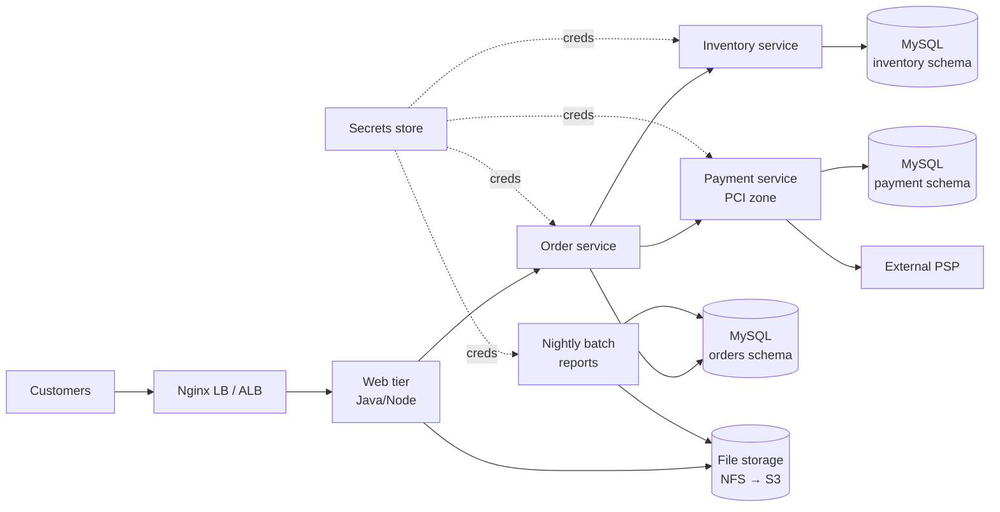

# 01 – Migration Assessment & Strategy (Order Management Domain)

**Target cloud: AWS (single account per environment, region `ap-south-1` primary, `ap-southeast-1` for DR snapshots).**
**Why AWS:** mature DMS with CDC for MySQL, EKS + IRSA for fine-grained pod IAM (needed for PCI isolation of the payment service), native Secrets Manager rotation for RDS, and S3 lifecycle tiers that fit the 2 TB NFS data. Azure would be equally viable; the design below is portable at the Kubernetes/Helm/pipeline layer and only the Terraform and DB-migration tooling are AWS specific.

> All figures and the FinNova environment are fictional per the assessment brief. No employer data is used.

## 1. Assumptions

| # | Assumption |
|---|---|
| A1 | Site-to-site connectivity (AWS Site-to-Site VPN, upgradable to Direct Connect) exists between the VMware DC and AWS before DB migration begins. |
| A2 | On-prem MySQL 5.7 has binary logging enabled (or can be enabled with a restart in a planned window before migration). |
| A3 | Peak write rate on the primary is ≤ 2,000 TPS; average binlog volume ≤ 40 GB/day. |
| A4 | Monolith split is in progress: order, inventory and payment each own a logical schema inside the same MySQL instance today. They will share one RDS instance in phase 1 with per-service DB users, and split to separate instances later. |
| A5 | PCI scope: payment service handles card tokens from a PSP (no raw PAN stored). Isolation is still required to reduce audit scope (PCI DSS segmentation). |
| A6 | Static assets, user uploads and reports on NFS are ~2 TB; ~70 % has not been read in 90 days. |
| A7 | MySQL 5.7 is end-of-life; target is **MySQL 8.0** (RDS). Application compatibility with 8.0 (auth plugin, reserved words, `sql_mode`) is tested in the staging replica before cutover. |

## 2. 6R Classification

| Component | Strategy | Justification |
|---|---|---|
| **Web tier** (Java/Node, 2 VMs + Nginx LB) | **Replatform** | Lift-and-shift VMs would not give blue/green or elastic scaling for sales events. Containerizing the existing app and running it on EKS behind an ALB (weighted target groups / Argo Rollouts) delivers canary and blue/green with minimal code change. Nginx LB is replaced by ALB + Ingress. |
| **Order Processing – order service** | **Refactor** (continue the in-flight split) | The monolith is already being decomposed; landing it directly as a containerized microservice avoids migrating a monolith twice. Stateless, scaled by HPA, DB credentials from Secrets Manager. |
| **Order Processing – inventory service** | **Refactor** | Same rationale; selected as the reference service in this PoC (Dockerfile, Helm, pipeline) because it is the lowest-risk to prove the pattern. |
| **Order Processing – payment service** | **Refactor** + isolate | Needs a dedicated node group, subnet, security group, IAM role and NetworkPolicy to shrink PCI scope. Cannot be a simple rehost because isolation and independent deploys are explicit requirements. |
| **Primary DB** (MySQL 5.7, 800 GB) | **Replatform** | Move to managed RDS MySQL 8.0 Multi-AZ with the same relational engine (no schema refactor), gaining automated backups, patching, and KMS encryption. DMS full load + CDC keeps the cutover under 5 minutes. Aurora was considered but rejected for PoC cost; revisit at 10x scale. |
| **Batch / reporting** (nightly cron → NFS) | **Replatform** | Convert cron to Kubernetes `CronJob`s on a Spot-backed node group writing to S3. Cost-efficient, low priority, tolerant to interruption (jobs are idempotent and re-runnable). |
| **File storage** (2 TB NFS) | **Replatform** | Move to S3 with lifecycle (Standard → Standard-IA at 30 days → Glacier Instant Retrieval at 90 days). Initial copy with AWS DataSync, then delta sync. Code that needs POSIX semantics uses the S3 Mountpoint CSI driver for read access during transition. |
| **Auth & secrets** (static files with DB creds) | **Replatform** (+ **Retire** the static config files) | Secrets move to AWS Secrets Manager (KMS CMK, rotation). Pods read them at runtime through the Secrets Store CSI driver and IRSA. The plaintext config files are retired and old credentials rotated at cutover. |

No component is marked *Repurchase*; *Retain* is limited to the on-prem MySQL primary until cutover completes and a 14-day rollback window ends. Retire applies to NFS server, Nginx VMs and static config files after the window.

## 3. Dependency Map

| From | To | Protocol / nature | Criticality |
|---|---|---|---|
| Customers | Nginx LB → ALB | HTTPS | High |
| Web tier | Order service | HTTP/gRPC (internal) | High |
| Order service | Inventory service | HTTP (reserve/release stock) | High |
| Order service | Payment service | HTTPS mTLS, idempotency key | Critical |
| Order / inventory / payment | MySQL (own schema each) | TCP 3306 | Critical |
| Payment service | External PSP | HTTPS | Critical |
| Web tier, batch | File storage (NFS → S3) | NFS / S3 API | Medium |
| Batch jobs | MySQL and file storage | TCP 3306, S3 | Low |
| All services | Secrets store | Credentials at startup / rotation | Critical |

Critical-path dependencies: **network + secrets → database → services → web tier → batch/files**. The database is the single shared dependency, so it drives sequencing.

## 4. Risk Register

| ID | Risk | Likelihood | Impact | Mitigation | Owner |
|---|---|---|---|---|---|
| R1 | Data loss or divergence during DB cutover | Med | Critical | DMS CDC with validation enabled; freeze writes (read-only) before final check; compare checksums; keep on-prem primary untouched with reverse replication for rollback. | DB lead |
| R2 | Downtime exceeds the 5-minute window | Med | Critical | Rehearse the cutover ≥ 3 times in staging with prod-sized data; scripted cutover (no manual steps); lower DNS TTL to 30 s a day earlier; pre-warm connection pools. | Migration lead |
| R3 | Credential exposure (plaintext configs, secrets in images or Git) | High | Critical | Secrets Manager + CSI; `gitleaks` in CI; Trivy secret scan on image; rotate all legacy credentials at cutover; no secrets in env vars or Helm values. | Security |
| R4 | PCI scope creep (payment traffic mixed with other tiers) | Med | High | Dedicated subnet, node group, SG, IAM role, NetworkPolicy default-deny; VPC Flow Logs and GuardDuty; quarterly segmentation test. | Security |
| R5 | Cost overrun (NAT data, over-provisioned DB, DMS left running) | High | Med | AWS Budgets with alerts at 50/80/100 %; right-size after 2 weeks of metrics; VPC endpoints to cut NAT traffic; DMS instance destroyed after validation; tag-based cost allocation. | FinOps |
| R6 | MySQL 5.7 → 8.0 incompatibility (collation, auth plugin, deprecated syntax) | Med | High | Run the app test-suite against an 8.0 replica in staging; `mysqlsh util.checkForServerUpgrade`; keep `sql_mode` aligned. | App leads |
| R7 | Replication lag or WAN bandwidth too low for the 800 GB full load | Med | High | Measure throughput ahead of time; use parallel DMS load (`MaxFullLoadSubTasks`), run full load off-peak; fall back to Snowball Edge if sustained < 100 Mbps. | Network |
| R8 | Hidden dependencies on NFS paths or hard-coded IPs | Med | Med | Dependency discovery with Application Discovery Service + `ss`/`lsof` traces for two weeks; config audit; feature flag for file backend. | App leads |
| R9 | Canary/blue-green release bug blocks sales event | Low | High | Change freeze 2 weeks before major sales; fast rollback via `helm rollback`; load test at 2x last peak. | Release mgr |
| R10 | State file loss or concurrent `terraform apply` | Low | High | S3 versioning + DynamoDB locking + per-env state; CI-only applies. | Platform |

## 5. Phased Migration Sequence

| Phase | Scope | Why this order | Exit criteria |
|---|---|---|---|
| **0 – Foundations** (week 1–2) | AWS landing zone, VPN, IaC pipeline, VPC, EKS (empty), Secrets Manager, ECR, observability | Everything else depends on network, identity and secrets. Low business risk. | Terraform applies cleanly in dev/staging; VPN tested. |
| **1 – Data plane preparation** (week 2–4) | S3 + DataSync for NFS (initial copy), RDS 8.0, DMS full load + CDC running, validation job | Longest lead-time activity (800 GB + 2 TB); running in parallel de-risks the cutover. Does not change production traffic. | CDC lag < 5 s steady; validation 100 % match. |
| **2 – Stateless services & batch** (week 4–6) | Inventory (pilot), then order, then batch CronJobs, pointing at the replica/RDS in staging | Low business priority first to prove pipeline, Helm, secrets; batch is low priority and cost-sensitive. | Staging soak test passes; pipeline promotes to prod-shadow. |
| **3 – Payment service** (week 6–7) | Dedicated PCI node group, NetworkPolicy, security review, canary | Critical + regulated; needs the pattern proven by phases 1–2. | Segmentation test and security sign-off. |
| **4 – Web tier cutover + DB cutover** (week 8) | Weighted DNS for web tier (10 → 50 → 100 %); DB cutover in a < 5 min window | Business-critical; done last when everything else is verified; DB cutover is combined with a low-traffic window. | Error rate and latency within SLO for 48 h. |
| **5 – Decommission** (week 10–12) | After 14-day rollback window: stop reverse replication, retire NFS, VMs, rotate legacy credentials | Avoid paying twice; reduce attack surface. | Sign-off from business owner. |
