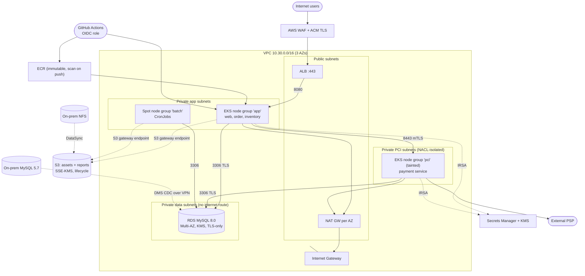

# 02 – Target Architecture & Infrastructure as Code

## 1. Source vs target

| Layer | Source (on-prem VMware) | Target (AWS, ap-south-1) |
|---|---|---|
| Edge / LB | Nginx on VM | ALB (AWS Load Balancer Controller), TLS 1.2+ terminated with ACM, AWS WAF |
| Web / services | 2 app VMs | Containers on EKS (private subnets), HPA + Cluster Autoscaler |
| Payment | Same VMs as monolith | Dedicated PCI node group + subnet + SG + IRSA role + NetworkPolicy |
| Database | MySQL 5.7 master/replica | RDS MySQL 8.0 Multi-AZ, private data subnets |
| Batch | cron on VM | Kubernetes CronJobs on Spot node group |
| Files | 2 TB NFS | S3 (SSE-KMS, lifecycle tiers) |
| Secrets | Static config files | Secrets Manager + KMS, mounted by Secrets Store CSI via IRSA |
| CI/CD | Manual | GitHub Actions → ECR → Helm → EKS |

## 2. Target-state diagram

The image version is `docs/architecture.svg` (also rendered into the Word/PDF pack). Editable Mermaid source:



## 3. Terraform layout

```
terraform/
├── bootstrap/                # one-time: state bucket (KMS, versioned) + DynamoDB lock table
├── modules/
│   ├── network/              # VPC, 4 subnet tiers x AZ, IGW, NAT, route tables, NACL, SGs, S3 endpoint, flow logs
│   ├── eks/                  # cluster, KMS secrets encryption, OIDC/IRSA, 3 node groups, add-ons
│   ├── rds/                  # MySQL 8.0, param group (TLS, ROW binlog), KMS, managed master secret
│   ├── secrets/              # Secrets Manager secrets + per-service least-privilege IRSA roles
│   └── storage/              # S3 assets/reports buckets + lifecycle
└── stack/                    # ONE root module, instantiated per environment
    ├── main.tf variables.tf outputs.tf versions.tf
    └── envs/
        ├── dev.tfvars     dev.backend.hcl
        ├── staging.tfvars staging.backend.hcl
        └── prod.tfvars    prod.backend.hcl
```

### Reusability across dev / staging / prod

* Modules contain **no environment logic**; everything differing between environments is a variable (`single_nat_gateway`, node sizes, `db_multi_az`, `deletion_protection`, retention).
* The root `stack/` is identical for every environment; behavior is selected with `-var-file=envs/<env>.tfvars` and `-backend-config=envs/<env>.backend.hcl`.
* Workspaces were considered and **rejected** for environment separation: they share one backend/credentials and make it easy to apply to the wrong environment. Separate state per environment (and ideally per AWS account) gives hard isolation.

| Setting | dev | staging | prod |
|---|---|---|---|
| AZs | 2 | 2 | 3 |
| NAT | 1 shared | 1 shared | 1 per AZ |
| App nodes | t3.large Spot, 1-3 | m6i.large, 2-4 | m6i.xlarge, 3-12 |
| PCI nodes | t3.large, 1-2 | m6i.large, 2-3 | m6i.large, 3-6 |
| RDS | db.t4g.medium, single-AZ, 100 GB | db.r6g.large, single-AZ, 1 TB | db.r6g.xlarge, Multi-AZ, 1 TB |
| Backup retention | 3 d | 7 d | 14 d |
| Deletion protection | off | on | on |
| EKS API endpoint | private | private | private |

### State management

| Concern | Approach |
|---|---|
| Backend | S3 bucket per environment (`finnova-tfstate-<env>-<account>`), created by `bootstrap/` |
| Locking | DynamoDB table `finnova-tf-locks` (`LockID`), prevents concurrent applies |
| Encryption | KMS CMK (`alias/finnova-tfstate`), TLS only, public access blocked |
| Versioning / recovery | S3 versioning on; DynamoDB PITR on; `prevent_destroy` on the bucket |
| Isolation | Separate bucket, key and (recommended) separate AWS account per environment; CI roles are per-env |
| Access | CI only. Humans have read-only; apply happens from the reviewed plan artifact (`terraform.yml`) |
| Secrets in state | Avoided: RDS uses `manage_master_user_password` (secret lives in Secrets Manager); app secrets are placeholders with `ignore_changes` |

## 4. Security-by-default (called out explicitly)

| Control | Implementation |
|---|---|
| No public DB | `publicly_accessible = false`, data subnets have **no default route**, DB SG allows 3306 only from the app and PCI node SGs (SG references, no CIDRs) |
| Encryption at rest | RDS (KMS CMK, also PI + logs), S3 SSE-KMS with bucket keys, EBS node volumes encrypted, EKS secrets envelope-encrypted with KMS, ECR KMS, Terraform state KMS |
| Encryption in transit | RDS `require_secure_transport=1`; S3 bucket policy denies `aws:SecureTransport=false`; ALB TLS 1.2+; service-to-payment mTLS on 8443; DMS endpoints use SSL; IMDSv2-only on nodes |
| Least-privilege IAM | One IRSA role per service; policy = `GetSecretValue` on **its own secret ARN** + `kms:Decrypt` via Secrets Manager only; node roles carry only the three AWS-managed minimum policies; CI roles split build (ECR push), deploy (EKS namespace) and Terraform plan (read-only) vs apply |
| Network | Default SG locked; SG-to-SG rules; NACL on PCI subnets; EKS API private; VPC flow logs; S3 gateway endpoint |
| Supply chain | Immutable ECR tags, scan on push, Trivy + gitleaks + hadolint in CI, distroless non-root image |
| Kubernetes | Pod `runAsNonRoot`, read-only root FS, all caps dropped, seccomp RuntimeDefault, NetworkPolicies default-deny |

## 5. Assumptions & intentional gaps (stated per the ground rules)

* Code is validated (`terraform validate`, `helm lint`) but **not applied** to a live account in this submission; costs would not be justified for a PoC. Expected behaviour is described in the runbook.
* Not included (listed for the follow-up discussion): AWS Load Balancer Controller / Secrets Store CSI / ASCP / Cluster Autoscaler (or Karpenter) / Argo Rollouts installs (Helm releases in a `platform/` stack), WAF rules, GuardDuty/Security Hub, Direct Connect, DR region.
* At 10x scale the first things to break are: single-writer RDS (move to Aurora + read replicas, split schemas per service), NAT data charges (add interface endpoints / VPC-native egress), and CoreDNS/ALB target registration limits.
